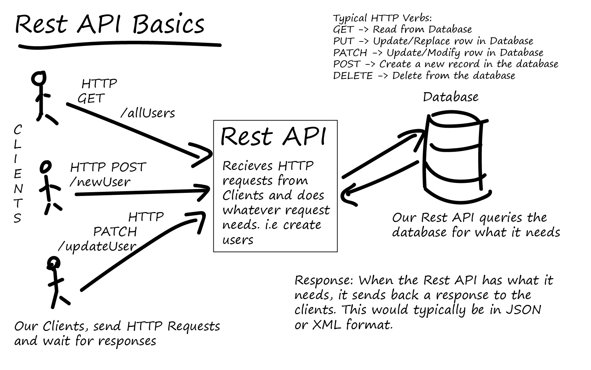

# Web Application Architectures WorkShop 6 : Event Loop, Fetch(), Promises, Rest API, Server-side

## Followup WS5

In the last workshop, one student wanted to insert a new dom element just after the first div element of the body, but he had to insert it after document.body.childNodes[4]. why ?  
isn't `

` the first dom node child of his `<body></body>` ?  
It is because all text blocks of your body are treated as DOM nodes, even white spaces. So if you have a space in your html, between your body and your first div, this space will be body.childNodes[0]. the div will be childNodes[1], the space(s) after 
 childNodes[2] and so on.  
( Text nodes cannot contain children. they are always leafs. )

## WS 5.1 Assignement Correction

Remarks :
- The storage is bound to the origin (domain/protocol/port triplet). 
- Data will be available for read/write to every javascript loaded from this origin.

---

### WS6 Revision questions

---

## Web, a Big Picture : Interface vs Data

In the precedent worskhop, you've created an **interface** to generate figures. Then you've stored all figures specifications into a Json object in localStorage : your **data**.

Internet is all about interfaces and data.

To be shareable, to be available 24/7 to users, data must be stored on a server. Think about the 30 trillions webpage in google's database.

To access this data, and act upon it, users need an interface. Think about google homepage : one text input, one search button, and results page : a list, and buttons to paginate results.

Before the mobile era, data and interfaces were usually mixed together on server side, and sent as HTML to the client. this is what we call **SERVER SIDE RENDERING (SSR)** ( some big websites, like Google Search, still use SSR for performance reasons)

Nowadays, since the data need to be accessible from different types of platforms, data and interfaces tend to be separated until they reach the browser :

- One server will send static html ,css, js and images to allow the browser to display an interface. Exactly like we did on WS2 using nginx.

- Then the interface in the browser will call another server, the REST API Server, to receive the data in JSON format and render it inside the interface **( CLIENT SIDE RENDERING, CSR)**, or to send the data inputted by the user. This Api Server commonly stores the data by communicating with a database server.

This is why full stack web developer has many jobs:  
- Creating the interface
- Creating the data model
- Make the interface available 24/7
- Make the data available 24/7

On small websites, API server, static files server and database server can be on the same machine. This is what we will implement during the next two sessions.

This big picture does not change a bit when using React. Your React file will be served as is by a web server, and executed by your browser. React code within your browser will in turn, call your API server to receive data and render the page upon it, and to send data when needed. ( not true when you do React SSR, but this is another story)

This will be the central subject of our 6th Workshop : 
Develop an interface that will make calls to a REST API.
Setup a server that will deliver the interface, and a server that will serve the REST API to speak with the interface.

In order to reach this objective, you need to know more about a few essential modern Javascript principles

 ( to know more on google search and SSR : https://news.ycombinator.com/item?id=22794143 )

---

## Modern Javascript Essential Concepts

### 1. Asynchronous execution, JS Event loop, Callbacks

Javascript is single-threaded
it can't in himself run many tasks simultaneously. 

" But I can see many js instructions happen simultaneously in my browser !"

Yes, it's because the browser can, it's written in c++

To handle this, Javascript offers non blocking, aynchronous functions. When you use them, Javascript will not wait until they are finished to execute the next line. Javascript will send them to the browser engine so that he can execute it, while Javascript goes to the next line.

To have a solid understanding of this concept, please watch this (very) important 26' video :   

**Must Watch:**  
https://www.youtube.com/watch?v=8aGhZQkoFbQ&t=1s

Important note regarding this video : at 16'22 , the speaker makes an AJAX request using XHR (XmlHttpRequest). To make it short, it's the old way of "using Fetch() to make a REST Api call". (https://developer.mozilla.org/en-US/docs/Glossary/AJAX)

Please note that since Node is running on the same javascript engine than your browser, this concept is valid on both sides : you can (must) write code that make use of this asynchronous ability, on the client AND on the server. The main reason being that web requests and responses take some time, and sometimes even time out, so you can't afford to block the execution of your code on every new request.

### 2. Using fetch to load external files, Promises

Wether in Vanilla JS or React, web interfaces usually make use of Fetch() to load external files from a distant server (Json from REST API, Images, etc..). Fetch is asynchronous, and uses Promises.   
**You must understand how to use Fetch() and how Promises work to become a proficient Javascript Web Developer.**

**Must Read:** 
https://github.com/robderon/WebApplicationArchitectures/blob/master/JS%20Load%20files%20with%20FETCH%20-%20Promises.pdf

---

## WS 6.1 Our first REST Api client  : 1h max.

Many web services offer access to their data through REST API. It's not your data, but some other service's data, hence the name :  3rd Party API's. Without going too much in details, a REST API is Server code that will respond to HTTP Request, to send and receive data. 

REST Api can serve different type of content, but JSON is very handy, because when your client javascript app will receive it, it is very easy to convert it into Javascript objects. ( and vice versa, when you need to send data to a server)

Meteo , spotify, covid ,  youtube, instagram, twitter, newspapers.. a lot of 3rd party api are waiting for you to integrate them in your apps.

Most APIs require you to use some kind of developer key, for reasons of security and accountability. 

Let's get fast into the subject.

**Assignment 6.1**

This Assignement is wrote for nytimes articles. If you'd prefer, you can do the same thing for youtube videos, or spotify albums. 

- Register at http://developer.nytimes.com
- Go to "Apps" section and create an APP to get your API key
- We will use the Article Search API's. Find its documentation.

- Compose the URL that will get the list of the last 10 articles for keyword "science"

- The domaine name is missing in the images url. find it. You can test the recomposed URL directly in your browser

- Use Fetch() to make your request to the API and get back articles list.

- Create a basic interface to display this list of articles  
every article block should display :  
    - Headline (linked to article url), 
    - Abstract
    - Publication date with format YYYY-MM-DD
    - First Image if there is any
    - The text must flow around the image using css float property (https://www.w3schools.com/css/css_float.asp)

- Create a text input and search button to be able to do a keyword search.
- Send me your codepen in a private zoom message

**Find help :**  
https://developer.mozilla.org/en-US/docs/Learn/JavaScript/Client-side_web_APIs/Third_party_APIs#a_restful_api_%E2%80%94_nytimes

---

## WS 6.2 Server-side introduction

### A few words on Client-side vs Server-side Development

**The question is not : "where does the content comes from"**
Because when your server is static, and send you html and js, content comes from the server, but we are still doing client side programming.  

**The question is "Which computer is executing your code "**
When nginx (or Node.js) send static html and js to a client, he will not interpret your code, he will just send the file as is to the client. it is the browser software, running on your machine, that will interpret html css and js to present you an interactive application. We are doing client side programming. When Node.js execute some Javascript to create a http Server waiting for your browsers requests, We are doing server side programming.

You can do a direct installation on your sytem, or use Docker.

**Launch Node with docker:**  

To be able to edit your node and react code directly from your host editor, you should bind mount a host directory in your container using -v

- Create a node-ws6 directory
- cd to this directory
- DON'T FORGET TO ALLOW ACCESS TO THIS DIRECTORY TO DOCKER in Settings | Ressources | File sharing
- `docker run -it -p 3000:3000 -v ${PWD}:/data --name nodereact node bash`

**Assignement :**  

**Must read before 6.2.1 :**  
https://github.com/robderon/WebApplicationArchitectures/blob/master/NODE.js%20and%20ExpressJS%20Hello%20World.pdf

6.2.1 : Create a Hello World app using Express.js responding on http://localhost/

**Must read before 6.2.2 :**  
https://github.com/robderon/WebApplicationArchitectures/blob/master/NODE.js%20Static%20Server.pdf

6.2.2 : Make your Figures drawing app available on the server ( 3 static files : html/js/css)

**Must read before 6.2.3 :**  
https://github.com/robderon/WebApplicationArchitectures/blob/master/NODE.js%20and%20ExpressJS%20Querying%20and%20Sending%20data.pdf

6.2.3 : Create a new API endpoint on the same Node server, to receive figures specifications in JSON format. Update your client app so that everytime you click on the button to display a new figure, you also send its specifications to the server using Fetch() and this API endpoint. For the time being, your server will only receive data and print it on its console (the Node Console, not the browser console...). You should be able to read JSON on your node terminal everytime you click "add figure" in your browser.

- this new API endpoint will materialize in your code as a new Express route :
    - POST is the best way in this case, because your want to send JSON data
    - Use bodyparser library to easily access the JSON sent by the browser
    - Choose the name of the route

- on client-side, starting from the code you use for localStorage, use Fetch() to make request and send data.  

6.2.4 : Logical next step would have been to add an endpoint so that the client could grab the figures specs from the server, but we don't know yet how to store them on server side ! this will be the subject of Workshop 7.

**For next week: Install Mongo, read mongo / mongo express slides.** 

https://github.com/robderon/WebApplicationArchitectures/blob/master/JS%20Async%20_%20Await.pdf

https://github.com/robderon/WebApplicationArchitectures/blob/master/Databases%20_%20MongoDB%20introduction.pdf

you can install MongoDB on your computer directly https://www.mongodb.com/try/download/community, or using Docker.

## How To Access your server from outside your local network ?

If you give your local  IP (192.X.X.X , or 10.X.X.X) to someone outside of your local network, and he tries to open http://192.X.X.X:3000 , it won't work. these adress cannot be accessed directly, they are made for local network. Only your router ("box") have a IP visible from the outside world. 

What can I do ?

- If you have access to your router, you can configure port forwarding. You will give your router public ip adress (the one you got when you go to https://www.whatismyip.com/ for instance) to the outside user, and you will ask your router to redirect all incoming traffic to port 3000 to your local IP.

- Or, maybe simpler, you could use localtunnel. (Ngrok free alternative)

## A few words about different API's  

You've read about REST API, webAPI,  Node API. But it seems like very different things.

API means application programming interface. It's a piece of software that allows two applications to speak together.  

- When your javascript code loads an image, or a JSON file, using Fetch(), it is using some c++ code inside the browser to do it. You are using the Fetch() function from the webAPI coded in c++ into your browser. It's like calling a function from an external compiled module in your python code (like the built in math module). So one program, your javascript code, is speaking with the browser, asking him to execute a function, and waiting for the response. 
 In the JS Event Loop video, the speaker is using the AJAX / XHR method. This is the old way of using external content to refresh your page. Ajax is gradually being replaced by Fetch API 

- When your Node javscript code is asking node to become an http server, you are making a local NodeAPI call. same thing as before, your javascript code calls a function coded in Node.js, and many of them can run in parralel. This is why a single Node.js server process is able to handle thousands of concurrent requests.

- When your javascript code needs to load JSON data from a REST Http server, you are making an API Call. It's a very different one from the two precedents, because the two programs are on different machine, it's using TCP/IP, and it's speaking HTTP and JSON.

